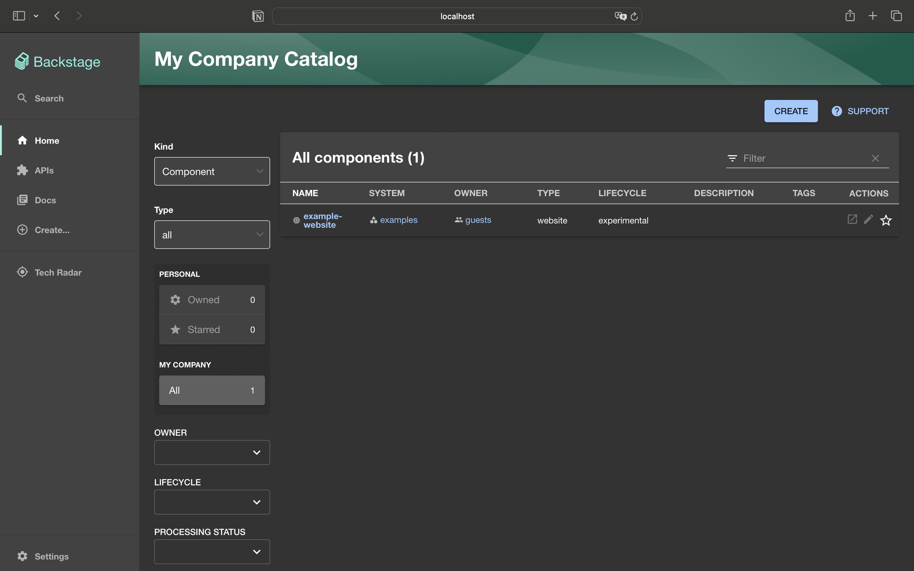
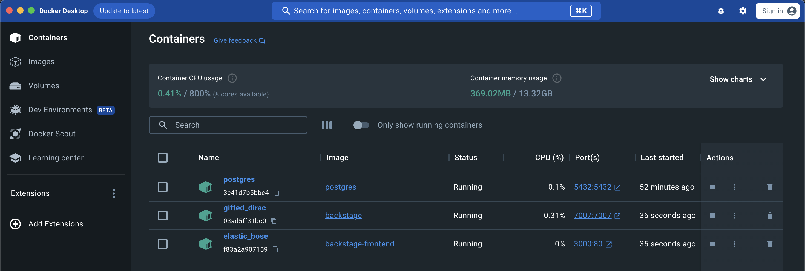
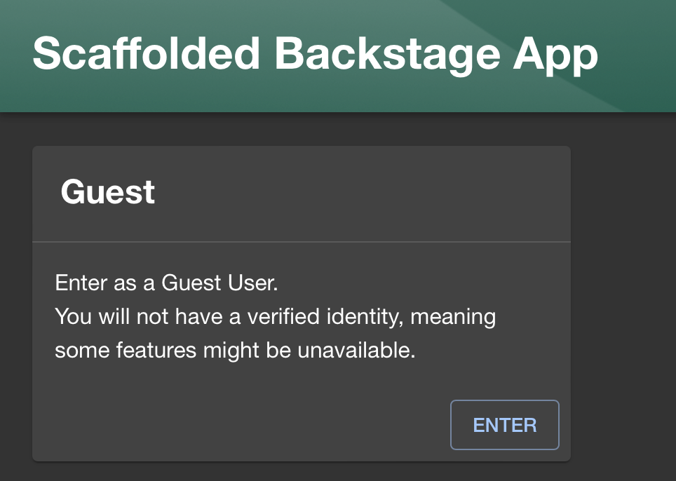
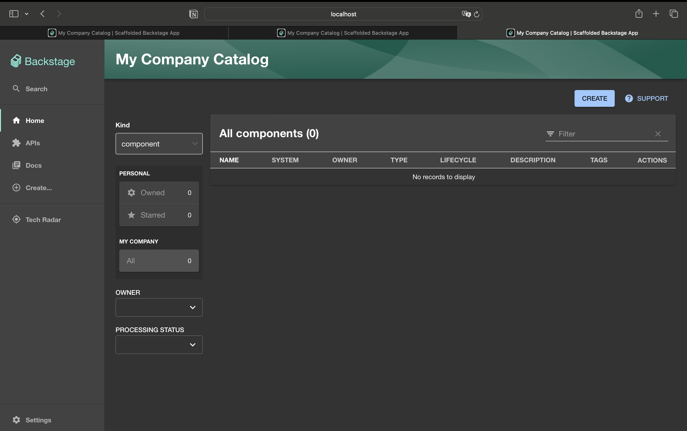

# Deploying Backstage on Docker
## Conceitos e tecnologias aprendidas
- **Docker**: permite empacotar, distribuir e executar aplicativos em ambientes isolados, tornando o desenvolvimento e a implantação mais rápidos e consistentes;
- **Backstage**: refere-se aos processos internos e recursos necessários para fornecer serviços;
- **Catálogo de Serviços**: descreve os serviços oferecidos por uma organização, detalhando as características, os custos, os requisitos e os benefícios associados a cada serviço.
## Processo de compilação e execução da ferramenta
A fim de construir um catálogo de serviços utilizando a ferramenta Backstage, foi utilizada uma abordagem de implantação do frontend e o back-end de uma aplicação como duas imagens separadas em Docker. Essa abordagem torna a arquitetura da aplicação mais modular, com componentes desacoplados e com uma implantação mais flexível.
### Passo-a-passo da implantação da ferramenta:
### Setup inicial
1. Criar uma aplicação padrão do Backstage
```
$ npx @backstage/create-app@latest --skip-install
```
2. Instalar dependencias e rodar localmente
```
$ yarn install
$ yarn dev
```
3. Configurar o arquivo ```app-config.production.yaml``` para permitir o método de login como "guest"
```
  auth:
    providers:
      guest:
        dangerouslyAllowOutsideDevelopment: true
```

### Deploy do Backend
4. Criar de uma chave aleatória em formato base64 para autenticação futura
```
  $ openssl rand -base64 32
```
5. Armazenar a chave no arquivo ```app-config.production.yaml```, seção ```backend```.
```
  auth:
    keys:
      - secret: ${YOUR_KEY}
```
6. Criação de uma rede Docker que irá concetar os 3 contâiners - Backend, Postgress e Frontend
```
  $ docker network create vnetbackstage
```
7. Rodar um container para a imagem do Postgress
```
  $ docker run --name postgres -p 5432:5432 -e POSTGRES_PASSWORD=password --net ${ID_DOCKER_NETWORK} -d postgres
```
8. Buildar e rodar um contâiner com a imagem do backend
```
  $ docker run -it -p 7007:7007 --net ${ID_DOCKER_NETWORK} -e POSTGRES_HOST=postgres -e POSTGRES_PORT=5432 -e POSTGRES_USER=postgres -e POSTGRES_PASSWORD=password backstage
```
```
    $ docker run -it -p 7007:7007 --net ${ID_DOCKER_NETWORK} -e POSTGRES_HOST=postgres -e POSTGRES_PORT=5432 -e POSTGRES_USER=postgres -e POSTGRES_PASSWORD=password backstage
```
### Deploy do Frontend
9. Criar um arquivo de configuração do servidor Nginx: raiz/docker/default.conf.template
```
  server {
    listen       $PORT;
    server_name  localhost;

    #charset koi8-r;
    #access_log  /var/log/nginx/host.access.log  main;

    location / {
        include /etc/nginx/mime.types;
        root   /usr/share/nginx/html;
        index  index.html index.htm;
        try_files $uri /index.html;
    }

    location /healthcheck {
        return 204;
    }

    #error_page  404              /404.html;

    # redirect server error pages to the static page /50x.html
    #
    error_page   500 502 503 504  /50x.html;
    location = /50x.html {
        root   /usr/share/nginx/html;
    }
}
```
10. Criar um arquivo ```inject-config.sh``` na pasta ```Docker``` com um script para injeção de configurações em tempo real
```
  set -Eeuo pipefail

  function inject_config() {
    # Read runtime config from env in the same way as the @backstage/config-loader package
    local config
    config="$(jq -n 'env |
      with_entries(select(.key | startswith("APP_CONFIG_")) | .key |= sub("APP_CONFIG_"; "")) |
      to_entries |
      reduce .[] as $item (
        {}; setpath($item.key | split("_"); $item.value | try fromjson catch $item.value)
  )')"

  >&2 echo "Runtime app config: $config"

  local main_js
  if ! main_js="$(grep -l __APP_INJECTED_RUNTIME_CONFIG__ /usr/share/nginx/html/static/*.js)"; then
    echo "Runtime config already written"
    return
  fi
  echo "Writing runtime config to ${main_js}"

  # escape ' and " twice, for both sed and json
  local config_escaped_1
  config_escaped_1="$(echo "$config" | jq -cM . | sed -e 's/[\\"'\'']/\\&/g')"
  # escape / and & for sed
  local config_escaped_2
  config_escaped_2="$(echo "$config_escaped_1" | sed -e 's/[\/&]/\\&/g')"

  # Replace __APP_INJECTED_RUNTIME_CONFIG__ in the main chunk with the runtime config
  sed -e "s/__APP_INJECTED_RUNTIME_CONFIG__/$config_escaped_2/" -i "$main_js"
}

inject_config
```
11. Criar Dockerfile do frontend em arquivo ```Dockerfile.hostbuild```
```
  FROM nginx:mainline

  RUN apt-get update && apt-get -y install jq && rm -rf /var/lib/apt/lists/*

  COPY packages/app/dist /usr/share/nginx/html
  COPY docker/default.conf.template /etc/nginx/templates/default.conf.template

  COPY docker/inject-config.sh /docker-entrypoint.d/40-inject-config.sh

  ENV PORT 80
```
12. Buildar o frontend, criar a imagem docker e rodar ela
```
  $ yarn workspace app build --config ../../app-config.yaml
```
```
  $ docker build -t backstage-frontend -f Dockerfile.hostbuild . 
```
```
  $ docker run -p 3000:80 --network ${ID_DOCKER_NETWORK} backstage-frontend
```
## Aplicação rodando ao final do tutorial
- Todas as imagens em docker:

- Aplicação rodando em ```localhost:3000```


